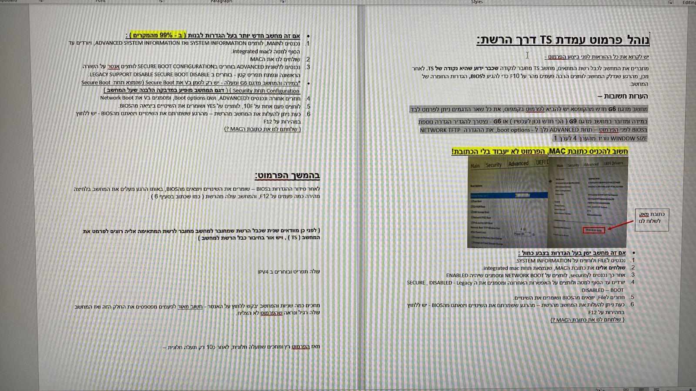
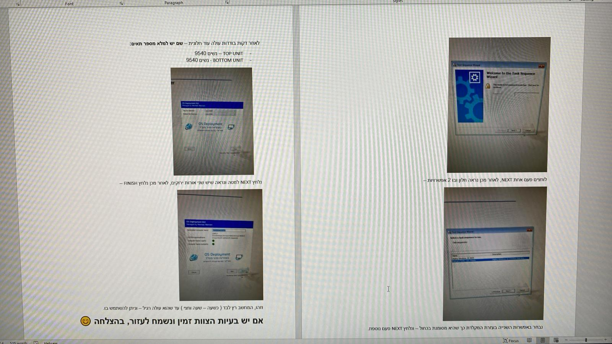
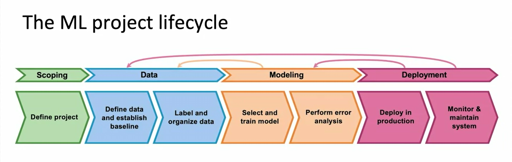

# Hafifa

## Python

In this section, we will base some basic knowledge about python.

### Best Practices

-   [ ] [Cohesion and Coupling](https://youtu.be/eiDyK_ofPPM?feature=shared)
-   [ ] [SOLID](https://youtu.be/pTB30aXS77U?feature=shared)

### OS & Concurrency

Getting to know parallel programming (multithreading/multiprocessing, asynchronous processing), and how to work with the operating system and file manage with python.

-   [ ] [python concurrency](https://realpython.com/python-concurrency/)
-   [ ] [python os module](https://reshetech.co.il/python-tutorials/the-os-module)

### Numpy

Getting to know numpy and its functions

-   [ ] [Tutorial](https://reshetech.co.il/machine-learning-tutorials/essentials-of-numpy)
-   [ ] [100 Exercises](https://github.com/rougier/numpy-100)

### Pandas

55 questions in pandas and 5 more in matplotlib

-   [ ] [100 Exercises](https://github.com/ajcr/100-pandas-puzzles)

## Git

We will use git for history and version management.
This is a must have tool in your arsenal!

-   [ ] [Tutorial](https://youtu.be/mJ-qvsxPHpY?feature=shared)
-   [ ] [Git immersion - (1-9, 24-26, 28-35)](https://gitimmersion.com)

## TS Setup

Welcome to the TS (Top Secret) Eco System:)
We will set up your computer to be ready to work for the next project - that will be developed inside the TS.

### Formatting

In order to use a new computer given to you from logistics, you must format it.
Use the following user guide:

**Note:** Where the user guide states to send someone a MAC address, you must send it to the "Campus".
Here is a phone number of Campus: 03-675767
Tell them you are formatting a new computer of clearance TOP SECRET, and that this is your MAC address.

### On Boarding - CTS

Now that you have access to the CTS go over some guides in _Confluence_.
-> Open Chrome
-> Write "Confluence" in the url search bar
-> Log in
-> Open the first site that is offered to you
-> Search in the searching bar (top right) "Text Factory"
-> Click on the first result
-> Click on "On Boarding" at the side bar to the left
-> Follow the "Getting Started" & "Working in CTS" Guides

## NLP

This section will give you a brief about our field of work - NLP.
This section is a combination of lectures and papers.
Enjoy🤓

### Stanford

-   [ ] [01 - Intro & Word Vectors](https://youtu.be/rmVRLeJRkl4?si=MpFkO67pRt9zBN-4)
-   [ ] [02 - Neural Classifiers](https://youtu.be/gqaHkPEZAew?si=ZFEhRlnA_NezPIxz)
    -   [ ] [GloVe](https://nlp.stanford.edu/pubs/glove.pdf)
-   [ ] [03 - Backprop and Neural Networks](https://youtu.be/X0Jw4kgaFlg?si=ja1-3DB96ADniama)
-   [ ] [04 - Syntactic Structure and Dependency Parsing](https://youtu.be/PSGIodTN3KE?si=le2QGoDOuUa1MneS)
-   [ ] [05 - Recurrent Neural networks (RNNs)](https://youtu.be/PLryWeHPcBs?si=8qJdWWNwjudI96JJ)
-   [ ] [06 - Simple and LSTM RNNs](https://youtu.be/0LixFSa7yts?si=y24QW6l6FvP1LkKD)
-   [ ] [07 - Translation, Seq2Seq, Attention](https://youtu.be/wzfWHP6SXxY?si=EnOfVpQ--ouFJxm4)
    -   [ ] [Attention is all you need](https://arxiv.org/abs/1706.03762)
-   [ ] [08 - Self-Attention and Transformers](https://youtu.be/LWMzyfvuehA?si=HxRJt-J2gWfKhO8u)
-   [ ] [09 - Pretraining](https://youtu.be/DGfCRXuNA2w?si=Ur5hm8xZsuRnfQYx)
    -   [ ] [BERT: Pre-training of Deep Bidirectional Transformers for Language Understanding](https://arxiv.org/abs/1810.04805)
    -   [ ] [GPT: Improving Language Understanding by Generative Pre-Training](https://cdn.openai.com/research-covers/language-unsupervised/language_understanding_paper.pdf)
-   [ ] [10 - RLHF](https://youtu.be/SXpJ9EmG3s4?si=60UG3s8oS7eQJSPx)
-   [ ] [15 - Add Knowledge to Language Models](https://youtu.be/y68RJVfGoto?si=oXV9zdjq1RGzOzAB)
-   [ ] [Building Large Language Models](https://youtu.be/9vM4p9NN0Ts?si=EsXXBVXU54jNxq3T)

### Papers

-   [ ] [RoBERTa: A Robustly Optimized BERT Pretraining Approach](https://arxiv.org/abs/1907.11692)
-   [ ] [Multilingual E5 Text Embeddings: A Technical Report](https://arxiv.org/abs/2402.05672)
-   [ ] [SimCSE: Simple Contrastive Learning of Sentence Embeddings](https://arxiv.org/abs/2104.08821)
-   [ ] [LoRA: Low-Rank Adaptation of Large Language Models](https://arxiv.org/pdf/2106.09685)
-   [ ] [GPT-3: Language Models are Few-Shot Learners](https://arxiv.org/abs/2005.14165)

### Nice to Read Papers

If you have any spare time, here are some papers that are "nice to have".

-   [ ] [T5: Exploring the Limits of Transfer Learning with a Unified Text-to-Text Transformer](https://arxiv.org/abs/1910.10683)
-   [ ] [DistilBERT, a distilled version of BERT: smaller, faster, cheaper and lighter](https://arxiv.org/abs/1910.01108)
-   [ ] [QLoRA: Efficient Finetuning of Quantized LLMs](https://arxiv.org/abs/2305.14314)
-   [ ] [The Llama 3 Herd of Models](https://arxiv.org/pdf/2407.21783)
-   [ ] [GPT-2: Language Models are Unsupervised Multitask Learners](https://cdn.openai.com/better-language-models/language_models_are_unsupervised_multitask_learners.pdf)

## Retrieval and Embedding

Techniques used to for efficient retrieval in large scale data environments. (no need to understand down the smallest detail)

-   [ ] [Understanding similarity or semantic search and vector databases](https://medium.com/@sudhiryelikar/understanding-similarity-or-semantic-search-and-vector-databases-5f9a5ba98acb)
-   [ ] [Approximate Nearest Neighbors : Data Science Concepts](https://youtu.be/DRbjpuqOsjk?feature=shared)
-   [ ] [Approximate Nearest Neighbors Oh Yeah (ANNOY)](https://sds-aau.github.io/M3Port19/portfolio/ann/)
-   [ ] [Understanding Hierarchical Navigable Small Worlds (HNSW)](https://www.datastax.com/guides/hierarchical-navigable-small-worlds)

## LLM basics

Practical courses about prompt engineering your LLM, and frameworks in python (such as LangChain) that make it simpler to use LLMs for retrieval and chatbot purposes.

-   The **1st** course is about the basics of LLMs, some uses they have, the Chain of Thought (CoT) reasoning techniques used to prompt them better, and prompt chaining.
-   The **2nd** course is about various prompt engineering techniques and many general uses for your LLM such as summarizing, inferring, etc.
-   The **3rd** course is about having a continuous conversation with your LLM (memory), Chains in LangChain, and a bit about agents
-   The **4th** course is about using LLMs to call functions, the LangChain expression language, routing and conversational agents

-   [ ] [Building Systems with the ChatGPT API](https://learn.deeplearning.ai/courses/chatgpt-building-system/lesson/1/introduction)
-   [ ] [ChatGPT Prompt Engineering for Developers](https://learn.deeplearning.ai/courses/chatgpt-prompt-eng/lesson/1/introduction)
-   [ ] [LangChain for LLM Application Development](https://learn.deeplearning.ai/courses/langchain/lesson/1/introduction)
-   [ ] [Functions, Tools and Agents with LangChain](https://learn.deeplearning.ai/courses/functions-tools-agents-langchain/lesson/1/introduction)
-   [ ] [DSPy vs. LangChain](https://qdrant.tech/blog/dspy-vs-langchain/)

### LLM Evaluation

Read some of the following metrics for evaluating LLM performances

-   [ ] [DeepEval - LLM Metrics](https://docs.confident-ai.com/docs/metrics-introduction)

## Prompt Engineering

### Theory

[The Prompt Engineering Guide](https://www.promptingguide.ai/) is a project by [DAIR.AI](https://github.com/dair-ai). It aims to educate researchers and practitioners about prompt engineering.

Read the [Introduction](https://www.promptingguide.ai/introduction) and [Techniques](https://www.promptingguide.ai/techniques) sections of the guide.
This guide will be our bible for prompt engineering and more. Read it thoroughly, and consider reading more of the guide beyond the sections required in this Hafifa.

### Practice - Frameworks

-   [ ] [DSPy](https://dspy.ai/)
-   [ ] [LangChain](https://python.langchain.com/docs/introduction/)

## RAG

Practical courses about RAG.

-   The **1st** course is about using LangChain for RAG, including explanations on embeddings, retrieval, reranking and answer generating.
-   The **2nd** course is about using LlamaIndex for RAG, some advanced techniques for RAG, and its evaluation.

-   [ ] [Large Language Models with Semantic Search](https://learn.deeplearning.ai/courses/large-language-models-semantic-search/lesson/1/introduction)
-   [ ] [Building and Evaluating Advanced RAG](https://learn.deeplearning.ai/courses/building-evaluating-advanced-rag/lesson/1/introduction)

### [RAG Techniques](https://github.com/NirDiamant/RAG_Techniques)

Welcome to one of the most comprehensive and dynamic collections of Retrieval-Augmented Generation (RAG) tutorials available today. This repository serves as a hub for cutting-edge techniques aimed at enhancing the accuracy, efficiency, and contextual richness of RAG systems.

In this section you are required to go over the [🌱 Foundational RAG Techniques](https://github.com/NirDiamant/RAG_Techniques?tab=readme-ov-file#-foundational-rag-techniques) topic.
In further RAG research make sure to go back to this repo, and go over the other more advanced topics of RAG.

**Note:** We will \*\*probably use `LlamaIndex` for RAG. Therefore, you might want to check out the `LlamaIndex` tutorial in this guide.

### RAG Evaluation

Read some of the following metrics for evaluating RAG performances

-   [ ] [RAGAS](https://docs.ragas.io/en/stable/)

\*\* Each framework has its own specialty. Currently, LlamaIndex works more in the RAG sections, but you might find other tools more suited to you in different RAG tasks.

### Unit Testing

We might want to perform unit testing to our LLM pipelines and RAGs. Here is a guide about

-   [ ] [Unit Testing LLMs/RAG With DeepEval](https://docs.llamaindex.ai/en/stable/community/integrations/deepeval/#unit-testing-llmsrag-with-deepeval 'Permanent link').

Take this section as food for thought of future use cases.

## MLOps

-   [ ] [Machine Learning in Production](https://www.coursera.org/learn/introduction-to-machine-learning-in-production/)

### EDA & Error Analysis

-   [ ] [Kaggle EDA and EA notebook](https://www.kaggle.com/code/egazakharenko/quality-metrics-and-error-analysis-in-ml-guide)

### Docker

-   [ ] [Docker Tutorial](https://youtu.be/pTFZFxd4hOI?feature=shared)

### Triton

-   [ ] [Conceptual Guide](https://github.com/triton-inference-server/tutorials/tree/main/Conceptual_Guide)

### FastApi

-   [ ] [FastApi Tutorial](https://youtu.be/SORiTsvnU28?si=cnRsmt-alLtkByn7)
-   [ ] [Further Tutorials (FastApi Docs)](https://fastapi.tiangolo.com/tutorial/#advanced-user-guide)

## RAG Project

Congratulations!
You have come to the final project of the Hafifa.
You can find all the information about it inside the TS network, in your Jira
